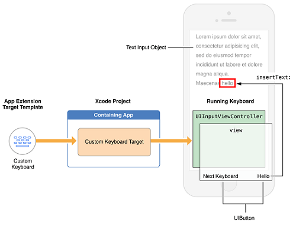
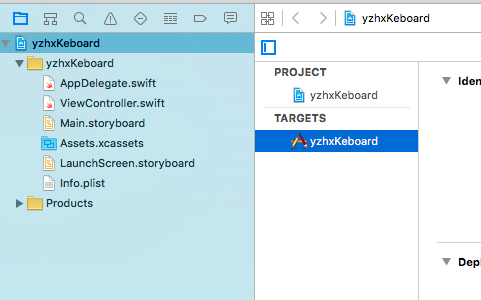
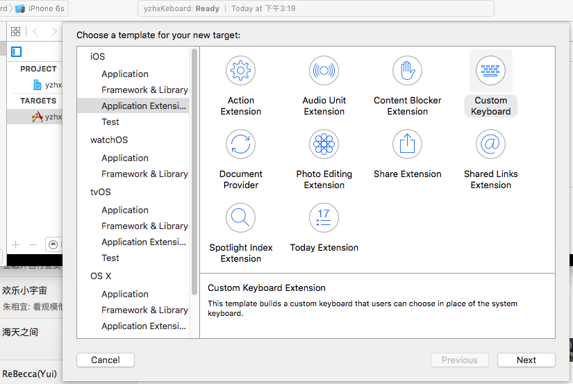
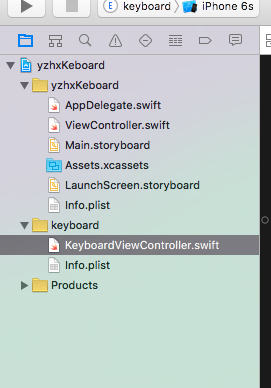
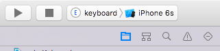
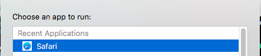
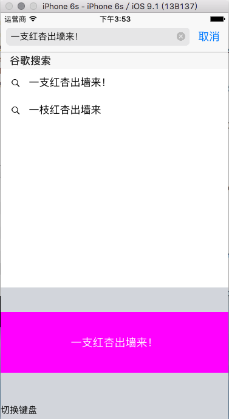

# 实战自定义键盘

# 0x01 来龙去脉
在iOS8之前，iOS系统的输入法只能使用苹果官方提供的输入法。
对于中文来说，官方的输入法并不好用，或者说不够好用，词库，联想，云输入等都没有或者和搜狗输入法，百度输入法等有中国特色的输入法相比有一定的差距。
部分用户因为输入法的原因，选择了安卓等其他系统，或者选择了越狱。
iOS自定义键盘是iOS8系统新推出的功能，允许开发者开发第三方键盘。众人拾柴火焰高，功能的开放，为iOS用户体验的提示必然带来更大的推动。


# 0x02 输入法的基本结构


输入法的项目可以使用普通的project模版，但是需要增加一个自定义键盘的Target，所有的人机交互，都在项目生成的UIInputViewController一个子类里实现。关键的要素如下：
* 一个Xcode的Project
* 一个自定义键盘的Target
* 一个UIInputViewController的子类
* 必须提供一个明显的切换到其他输入法的按钮

# 0x03 功能需求描述
1. 键盘上提供一个按钮，点击之后输入“一支红杏出墙来”

# 0x04 软件设计

```sequence
title:软件使用流程
用户-->系统:切换输入法
系统-->app:展示键盘
app-->控制器:展示"一支红杏出墙来"按钮
app-->控制器:展示"切换输入法"按钮
用户-->控制器:点击“一只红杏出墙来”按钮
控制器-->app:在当前的输入区域中中输入“一枝红杏出墙来"

```

# 0x05 实现
## 0x0501. 建立一个单视图的project

## 0x0502. 增加一个自定义键盘的target(Custom Keyboard)

添加之后，会看到有一个文件：KeyboardViewController，这是我们的主战场

## 0x0503. 编辑代码
代码的内容很简单，创建两个按钮，一个点击之后，切换输入法，一个点击之后，向当前输入控件里添加”一枝红杏出墙来"

```coffee
//
//  KeyboardViewController.swift
//  keyboard
//
//  Created by qi on 15/12/3.
//  Copyright © 2015年 im.windgo. All rights reserved.
//

import UIKit

class KeyboardViewController: UIInputViewController {

    @IBOutlet var nextKeyboardButton: UIButton! //切换输入法
    @IBOutlet var yizhihongxingButton: UIButton! //输入一支红杏出墙来的按钮
    override func updateViewConstraints() {
        super.updateViewConstraints()
    
        // Add custom view sizing constraints here
    }

    override func viewDidLoad() {
        super.viewDidLoad()
    
        // Perform custom UI setup here
        
        //创建切换到另一个键盘的按钮
        self.nextKeyboardButton = UIButton(type: .System)
        self.nextKeyboardButton.setTitle(NSLocalizedString("切换键盘", comment: "切换到下一个键盘的按钮"), forState: .Normal)
        self.nextKeyboardButton.sizeToFit()
        self.nextKeyboardButton.translatesAutoresizingMaskIntoConstraints = false
        self.nextKeyboardButton.addTarget(self, action: "advanceToNextInputMode", forControlEvents: .TouchUpInside)
        self.view.addSubview(self.nextKeyboardButton)
        
        let nextKeyboardButtonLeftSideConstraint = NSLayoutConstraint(item: self.nextKeyboardButton, attribute: .Left, relatedBy: .Equal, toItem: self.view, attribute: .Left, multiplier: 1.0, constant: 0.0)
        let nextKeyboardButtonBottomConstraint = NSLayoutConstraint(item: self.nextKeyboardButton, attribute: .Bottom, relatedBy: .Equal, toItem: self.view, attribute: .Bottom, multiplier: 1.0, constant: 0.0)
        self.view.addConstraints([nextKeyboardButtonLeftSideConstraint, nextKeyboardButtonBottomConstraint])
        
        
        yizhihongxingButton=UIButton()
        yizhihongxingButton.backgroundColor=UIColor.magentaColor()
        yizhihongxingButton.setTitle("一支红杏出墙来！", forState: UIControlState.Normal)
        yizhihongxingButton.frame=CGRectMake(0, 40, UIScreen.mainScreen().bounds.width, 100)
        yizhihongxingButton.addTarget(self, action: "onInputText", forControlEvents: UIControlEvents.TouchUpInside)
        self.view.addSubview(yizhihongxingButton)
        

    }
    

    override func didReceiveMemoryWarning() {
        super.didReceiveMemoryWarning()
        // Dispose of any resources that can be recreated
    }

    override func textWillChange(textInput: UITextInput?) {
        // The app is about to change the document's contents. Perform any preparation here.
    }

    override func textDidChange(textInput: UITextInput?) {
        // The app has just changed the document's contents, the document context has been updated.
    
        var textColor: UIColor
        let proxy = self.textDocumentProxy
        if proxy.keyboardAppearance == UIKeyboardAppearance.Dark {
            textColor = UIColor.whiteColor()
        } else {
            textColor = UIColor.blackColor()
        }
        self.nextKeyboardButton.setTitleColor(textColor, forState: .Normal)
    }
    
    func onInputText(){
        self.textDocumentProxy.insertText("一支红杏出墙来！")
    }


```

## 0x05004. 运行代码
* 选择运行的target

* 执行会让你选择在哪个应用里使用键盘，选择Safari浏览器就可以了

* 选择地址栏，进入输入状态，可以看到键盘，点击会输入“一支红杏出墙来！”
* 
> 注意：如果看不到键盘，可以切换下输入法，如果输入法里面没有，需要到“设置”里面将键盘加入。
---
>  更深入的技术细节：英文号的可以看[官方文档](https://developer.apple.com/library/ios/documentation/General/Conceptual/ExtensibilityPG/Keyboard.html)
喜欢看中文的可以看[翻译官方文档](http://www.cocoachina.com/ios/20140918/9677.html)